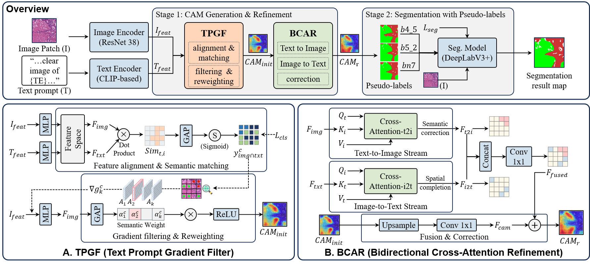

# 🧠 TP-CAM: Text Prompted Class Activation Maps for Weakly Supervised Histopathological Image Segmentation


---

## 📖 Introduction
This repository provides the main implementation of **[TP-CAM: Text Prompted Class Activation Maps for Weakly Supervised Histopathological Image Segmentation]**, a mehod for **weakly supervised semantic segmentation (WSSS)** in histopathological images.

---

## 📝 Abstract
Histopathological image semantic segmentation is crucial for cancer diagnosis and prognosis prediction. Although weakly supervised semantic segmentation (WSSS) methods based on class activation maps (CAM) have reduced reliance on pixel-level annotations, they suffer from incomplete activation, capturing only highly discriminative local features rather than complete semantic regions. This limitation is particularly severe in histopathological images due to tissue co-occurrence and indistinct boundaries, where image-level labels alone provide insufficient supervision for spatial localization. To address this challenge, we propose a histopathological image segmentation method named TP-CAM, which leverages text prompts as global semantic guidance to complement the supervision from image-level labels. Unlike image-level labels that only indicate category presence, text embeddings encode holistic semantic concepts that guide the model toward complete region activation. Specifically, we introduce a Text Prompt Gradient Filter (TPGF) module that performs semantic filtering of image features using text guidance in the gradient domain, effectively decoupling discriminative features for co-occurring tissues and localizing distinct regions to generate semantically coherent initial CAMs. Furthermore, we propose a Bidirectional Cross-Attention Refinement (BCAR) module including text-to-image stream and image-to-text stream to balance global semantic guidance with local structural precision for refining initial CAMs. And the former performs semantic verification to ensure activation correctness while the latter incorporates fine-grained visual details to guarantee structural completion. Finally, pseudo-labels with multi-modal semantic information derived from refined CAMs are used to train the segmentation model for histopathological image segmentation. Extensive experiments on two publicly benchmarks demonstrate that our method achieves average mIoU scores of 0.7764 and 0.7349, outperforming state-of-the-art WSSS methods. Furthermore, the potential benefits of our method to cross-dataset transfer and semantic segmentation for whole slide images are discussed.

---

## 📂 Datasets
📥 Download datasets from:
You can download the two datasets we used from the following two links. 
-[LUAD-HistoSeg](https://drive.google.com/drive/folders/1E3Yei3Or3xJXukHIybZAgochxfn6FJpr?usp=sharing)
-[BCSS-WSSS](https://drive.google.com/drive/folders/1iS2Z0DsbACqGp7m6VDJbAcgzeXNEFr77?usp=sharing)

---

## ⚙️ Requirements
- 🐍 Python
- 🔥 pytorch
- 👁️ torchvision
- ⚡ CUDA
- 💻 At least 1×GPU

---

## 📌 Prerequisite
Before training, download pretrained weights:
- To train the classification and segmentation stages, you should download the pre-trained weights for ResNet-38 and DeepLabV3+:
- 🔗 [baidu cloud](https://pan.baidu.com/s/1sQp4Na-883pSxgMWK4wcRQ) (code **nylc**)
- 🔗 [onedrive](https://1drv.ms/u/s!AgOtqK2ZncKlgoRobleElpBC5rbf7A?e=bDfqks) 
Place put them in the **init_weights** folder.

---

### 🗂️ Dataset Structure
Ensure your dataset is organized as follows:

TP-CAM/

    |_ datasets
    |     |_ BCSS-WSSS/
    |         |_ train/
    |            |_ img/
    |            |_ prompt/
    |         |_ val/
    |         |_ test/
    |     |_ LUAD-HistoSeg/
    |         |_ train/
    |            |_ img/
    |            |_ prompt/
    |         |_ val/
    |         |_ test/
 
---

## 🚀 Usage Guide

###  ✅One-click run (Recommended)
- In this work, our method include two stage~(**Classification**, **Segmentation**).
You can directly run run.sh to complete the two-part training and test.
- 👉To run the whole method, you need to specify the dataset related hyperparameters. Please see the command in run.sh.

```bash
bash run.sh
```

---

### 🔧Step-by-step 
- The whole method includes the step of classification model training and segmentation model training(including pseudo-labels generation). You can use following scripts to run each step.
- Please specify the argument in the command. You can also check run.sh to see more details.
#### 🧩1、Train the classification model: 

```bash
python enhance_cam.py --dataset luad --trainroot datasets/LUAD-HistoSeg/train/ --testroot datasets/LUAD-HistoSeg/test/
```

#### 🧩2、Train the segmentation model: 

```bash
python mask_seg.py --dataset luad --dataroot datasets/LUAD-HistoSeg
```

---

✨ Now you're ready to run TP-CAM!